---
# Global deck settings
theme: default
title: "Vlinder x Shell — Anti-Counterfeit & Carbon Intelligence"
info: |
  9-slide branded deck for Vlinder using official color palette and enhanced layouts.
  Slide 2 implements the detailed two-column spec with color-coded metrics and callout pills.
class: text-left
mdc: true
transition: slide-left
fonts:
  sans: Inter, ui-sans-serif, system-ui, -apple-system, Segoe UI, Roboto, Helvetica Neue, Arial
  mono: ui-monospace, SFMono-Regular, Menlo, Monaco, Consolas, "Liberation Mono", "Courier New", monospace
css: |
  @import "./style.css";
---

# Vlinder x Shell

  
  

    <h2 class="text-hero" style="margin: 6px 0 8px 0; color: var(--theme-text-primary);">Authenticity & Carbon Intelligence</h2>
    

      Protect brand integrity and quantify carbon with verifiable, real-time intelligence
    

    

      <button class="btn-primary">Get Started</button>
      <button class="btn-secondary">Learn More</button>
    

    

      Vlinder Labs • for Shell | Presenter: Team Vlinder • Date
    

  

---

# Key Challenges (Vlinder)

---
css: |
  /* Key Challenges on white canvas — use global light tokens, only ensure sizing/spacing */
  .slidev-layout.key-challenges {
    background: var(--theme-bg-canvas);
    color: var(--theme-text-primary);
    font-family: Inter, "Helvetica Neue", Arial, sans-serif;
    line-height: 1.35;
  }

  .kc-wrap {
    max-width: 1120px;
    margin: 0 auto;
    padding: 48px;
  }

  .kc-header {
    text-align: center;
    color: var(--accent-red);
    font-weight: 800;
    font-size: 26px;
    letter-spacing: 0.4px;
    text-transform: uppercase;
    margin: 12px 0 32px 0;
  }

  .kc-grid {
    display: grid;
    grid-template-columns: 1fr 48px 1fr; /* left | gutter | right */
    align-items: start;
  }

  .kc-col {
    display: flex;
    flex-direction: column;
    gap: 14px;
  }

  /* Warm section badge */
  .kc-badge {
    display: inline-flex;
    align-items: center;
    gap: 8px;
    background: var(--badge-bg-warm);
    border: 1px solid var(--badge-border-warm);
    border-radius: 6px;
    padding: 6px 10px;
    color: var(--accent-red);
    font-weight: 800;
    font-size: 12.5px;
    text-transform: uppercase;
    width: fit-content;
  }
  .kc-badge .icon {
    width: 16px; height: 16px;
    display: inline-block;
  }

  /* Left large stat */
  .kc-stat { color: var(--primary-text); }
  .kc-stat .num {
    font-weight: 900;
    font-size: 42px;
    line-height: 1.05;
    letter-spacing: -0.02em;
  }
  .kc-stat .desc {
    margin-top: 6px;
    font-size: 13.5px;
    font-weight: 700;
  }
  .kc-stat .mark {
    background: var(--badge-bg-warm);
    padding: 0 4px;
    border-radius: 3px;
  }

  /* Monetary impact line */
  .kc-money {
    color: var(--primary-text);
    font-size: 16px;
  }
  .kc-money b {
    font-weight: 800;
  }
  .kc-money .annual {
    background: #FADDD4;
    color: #8B2A1E;
    border-radius: 4px;
    padding: 2px 6px;
    font-size: 11px;
    font-weight: 700;
    margin-left: 6px;
  }

  /* Bullets with colored dots */
  .kc-bullets {
    list-style: none;
    padding: 0;
    margin: 0;
    display: grid;
    gap: 8px;
  }
  .kc-bullets li {
    display: grid;
    grid-template-columns: 10px 1fr;
    gap: 8px;
    color: var(--muted-text);
    font-size: 14.5px;
  }
  .kc-dot {
    width: 6px;
    height: 6px;
    border-radius: 50%;
    margin-top: 7px;
  }
  .kc-dot.cyan { background: var(--accent-cyan); }
  .kc-dot.teal { background: #1DA29A; } /* from design notes */
  .kc-dot.blue { background: var(--accent-blue-dark); }

  /* Right column – emission stat */
  .kc-emiss { color: var(--primary-text); }
  .kc-emiss .line1 {
    font-size: 30px;
    font-weight: 900;
    letter-spacing: -0.02em;
  }
  .kc-emiss .line1 small {
    font-size: 19px;
    font-weight: 800;
  }
  .kc-emiss .caption {
    font-size: 12.5px;
    color: var(--muted-text);
    font-weight: 700;
    margin-top: 4px;
  }

  .kc-subtitle {
    font-weight: 800;
    color: var(--primary-text);
    margin-top: 2px;
  }

  /* Progress pills */
  .kc-pills {
    display: grid;
    gap: 8px;
  }
  .kc-pill {
    background: var(--pill-blue-bg);
    color: var(--pill-blue-text);
    font-weight: 800;
    font-size: 13.5px;
    border-radius: 6px;
    padding: 8px 10px;
    display: inline-flex;
    gap: 8px;
    align-items: center;
  }
  .kc-pill.strong {
    background: var(--pill-blue-strong-bg);
  }
  .kc-pill .check {
    width: 14px;
    height: 14px;
    border-radius: 999px;
    background: var(--accent-blue-dark);
    display: inline-block;
  }

  /* Responsive adjustments */
  @media (max-width: 1023px) {
    .kc-wrap { padding: 40px 32px; }
    .kc-grid { grid-template-columns: 1fr; row-gap: 24px; }
    .kc-header { font-size: 24px; }
    .kc-stat .num { font-size: 38px; }
    .kc-emiss .line1 { font-size: 27px; }
  }
  @media (max-width: 767px) {
    .kc-wrap { padding: 32px 24px; }
  }
class: "key-challenges"
---

<!-- Layout -->

  
KEY CHALLENGES

  

    <!-- LEFT COLUMN -->
    

      
THE COUNTERFEIT CRISIS

      

        
10%

        
of Global Lubricants Are Counterfeit

      

      

        <b>$1.8 TRILLION</b> annual global counterfeiting cost.annual
      

      <ul class="kc-bullets">
        <li>20% market penetration in key regions</li>
        <li>20% market penetration in key regions</li>
        <li><b>INR 5,500 CRORE</b> counterfeit market in India alone</li>
        <li>Shell also faces significant counterfeiting in Rajasthan, Gujarat & Southern states</li>
      </ul>
    

    

 <!-- gutter -->

    <!-- RIGHT COLUMN -->
    

      

        <!-- simple footprint icon using emoji fallback; could be replaced by inline SVG -->
        🦶
        CARBON TRACKING COMPLEXITY
      

      

        
1.2 BILLION <small>TONS CO2e</small>

        
Shell’s annual emissions (2024)

      

      <ul class="kc-bullets" aria-label="Carbon tracking pain points">
        <li>Energy-intensive production processes</li>
        <li>Lack of standardized carbon measurement across supply chain</li>
        <li>Complex visibility gaps from sourcing to end-use</li>
      </ul>

      
Shell’s Current Progress:

      

        
30% carbon intensity reduction since 2016

        
700,000 TONNES CO2e offset annually

        
50% renewable energy in blending plants

      

    

  

---

# Why Vlinder

  

    

      
Brand Integrity

      <h3 class="feature-title">End-to-End Anti-Counterfeit</h3>
      <ul class="points-clean">
        <li>Secure serialization with tamper-proof identity</li>
        <li>Field-ready verification mobile UX</li>
        <li>Distributor and channel compliance visibility</li>
      </ul>
    

    

      
Carbon Intelligence

      <h3 class="feature-title">Quantify and Reduce Emissions</h3>
      <ul class="points-clean">
        <li>Product and batch-level carbon intensity</li>
        <li>Auditable MRV with verifiable records</li>
        <li>Real-time dashboards and alerts</li>
      </ul>
    

  

  

    

      
Vlinder x Shell Journey Diagram

    

  

---

# Solution Overview
A unified platform to authenticate products and trace carbon across the lifecycle

  

    
99.5%

    
Verification Accuracy

  

  

    
50%

    
Fraud Reduction

  

  

    
24/7

    
Field Support

  

  

    
Core

    <h3 class="feature-title">Intelligent Authentication</h3>
    
Digitally signed identities per pack and supply-chain checkpoints

  

  

    
Traceability

    <h3 class="feature-title">Chain-of-Custody Tracking</h3>
    
Granular events from blending to retail

  

  

    
MRV

    <h3 class="feature-title">Verifiable Carbon Records</h3>
    
Audit-grade measurements with data provenance

  

---

# Architecture Overview

```mermaid
%%{init: {
  "theme": "neutral",
  "themeVariables": {
    "primaryTextColor": "#111827",
    "primaryColor": "#FFFFFF",
    "lineColor": "#9CA3AF",
    "tertiaryColor": "#F3F4F6"
  }
}}%%

flowchart TD
    PackID[🔐 Pack Identity Service] --> Auth[🪪 Signing & Verification]
    PackID --> Events[📦 Chain-of-Custody Events]
    Events --> MQ[📬 Stream / Queue]
    MQ --> Analytics[📊 Analytics & Dashboards]
    Emissions[🌍 Carbon MRV Engine] --> Records[📜 Verifiable Records]
    Records --> Analytics
    API[⚙️ API Gateway] --> PackID
    API --> Emissions
    UI[🖥️ Field & Web Apps] --> API

    style UI fill:#FFFFFF,stroke:#4A90D9,stroke-width:2px,color:#111827
    style API fill:#FFFFFF,stroke:#4A90D9,stroke-width:2px,color:#111827
    style PackID fill:#FFFFFF,stroke:#4A90D9,stroke-width:2px,color:#111827
    style Emissions fill:#FFFFFF,stroke:#2D6FB3,stroke-width:2px,color:#111827
    style Records fill:#FFFFFF,stroke:#74AEE6,stroke-width:2px,color:#111827
    style Analytics fill:#FFFFFF,stroke:#FFC75A,stroke-width:2px,color:#111827
```

---

# Use Cases

  
<h3 class="feature-title">Retail Authentication</h3>
Scan & verify at point of sale

  
<h3 class="feature-title">Distributor Compliance</h3>
Channel-level visibility

  
<h3 class="feature-title">Field Inspection</h3>
Rapid checks in hotspots

  
<h3 class="feature-title">Product Carbon Footprint</h3>
Batch-level PCF and analytics

  
<h3 class="feature-title">Sustainability Reporting</h3>
Audit-grade MRV exports

  
<h3 class="feature-title">Counterfeit Heatmaps</h3>
Targeted intervention planning

---

# Pilot Plan & Timeline

  

    

    

      
Phase 1: Weeks 0–4

      <h4>Discovery & Setup</h4>
      <ul class="points-clean">
        <li>Finalize SKUs, plants, and channels for pilot</li>
        <li>Provision identity, mobile apps, and dashboards</li>
        <li>Data integration plan with Shell systems</li>
      </ul>
    

  

  

    

    

      
Phase 2: Weeks 5–10

      <h4>Field Deployment</h4>
      <ul class="points-clean">
        <li>Rollout serialization for selected SKUs</li>
        <li>Distributor and retail scanning in hotspots</li>
        <li>PCF data ingestion and MRV validation</li>
      </ul>
    

  

  

    

    

      
Phase 3: Weeks 11–14

      <h4>Insights & Scale</h4>
      <ul class="points-clean">
        <li>Counterfeit heatmaps and loss reduction</li>
        <li>Carbon insights and reduction opportunities</li>
        <li>Scale-up plan and ROI summary</li>
      </ul>
    

  

---

# Success Metrics

  

    
-50%

    
Counterfeit Incidents

  

  

    
+30%

    
Channel Compliance

  

  

    
20–40%

    
Carbon Data Coverage

  

  

    
&lt;6w

    
Time-to-Value

  

  

    
99.9%

    
Data Integrity

  

  

    
24/7

    
Ops Support

  

---

# Case Study Snapshot

  

    

      
Context

      <h3 class="feature-title">Automotive Lubricants — Regional Pilot</h3>
      <ul class="points-clean">
        <li>Hotspot states: Rajasthan, Gujarat, Southern regions</li>
        <li>Multi-tier distribution with retail verification</li>
        <li>SKU serialization and mobile scan adoption</li>
      </ul>
    

    

      
Challenge

      <ul class="points-clean">
        <li>High counterfeit penetration in targeted markets</li>
        <li>Limited visibility on last-mile leakage</li>
        <li>Fragmented carbon data across the chain</li>
      </ul>
    

  

  

    

      
Results

      <h3 class="feature-title">Measured Impact</h3>
      <ul class="points-clean">
        <li>Counterfeit incidents reduced by 40–60%</li>
        <li>Distributor compliance improved by 25–35%</li>
        <li>PCF baseline established across target SKUs</li>
      </ul>
    

    

      
Before/After Trendlines

    

  

---

# Next Steps

  

    
Partner with Vlinder

    <h2 class="text-hero">Secure authenticity. Quantify carbon. Accelerate impact.</h2>
    
Deploy a focused pilot in counterfeit hotspots with carbon insights at the product level.

    

      <button class="btn-primary">Kick off Pilot</button>
      <button class="btn-secondary">Schedule Working Session</button>
    

  

  

    

      
Contacts

      <ul class="points-clean">
        <li>Sales: sales@vlinder.one</li>
        <li>Support: support@vlinder.one</li>
        <li>Website: www.vlinder.one</li>
      </ul>
      
Shell + Vlinder — Confidential • 2025

    

  

